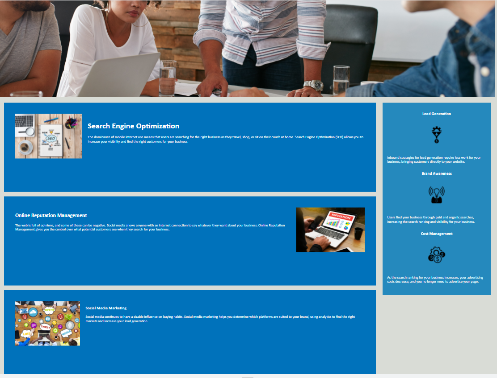

# w1-marketing-agency-resubmit

# Description

The website client website needs to be refactored to follow the accessibility standards by including more semantic elements and following best practices when writing the code (add comments, remove repetitive code)

# Repository

The project repository can be found here: https://talexandru1987.github.io/w1-marketing-agency-resubmit/

# Img Before

# Img after

To help follow the accessibility standards for a website 
the bellow changes were conducted

# Refactor Criteria

 Make it accessible
- Possibly refactor CSS code
- Use semantic HTML elements where possible
- Include comments
- Make sure the page has a logical structure (title, header, body, footer)
- There should be a logical order to headings (h1->h6)
- Ensure there are alt attributes for all images and keep it descriptive
- Document title (head element) should be descriptive
- Search Engine Optimisation nav link is broken (fix it) 
- Remove duplicate class names in CSS and replace with generic class name in HTML

# IMPLEMENTED CHANGES!

***Index.html******
Metadata section:
- changed the title to "Marketing Agency"
- the console log displays a 404 error on the page 
because of no favicon so one was added
- added keywords, title, author and description to help search engines
-added the viewport to help scale the website on different devices

Body Element:

- changed the website logo "Horiseon" from a heading to a paragraph with an id to help css style
-updated the class naming conventions

 Inside the Class "content":
- an id was added in the first div (line 40)
- added an alt attribute to all the images
- changed the multiple h2  to h1 ,h2 and h3 to help screen readers understand the order of the content

Inside the class benefits:
- added alt elements for all the images
-changed the h elements to h4,h5,h6

-replace the class footer with a footer element to help screen readers
-replace the h used in the footer with a p element with a class to help with css style

*****styles.css******

- updated the h elements to have the same size and style
- included the footer element into the file and replaced the footer div 
- added comments in the code